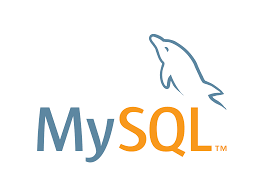

<html>
  <body>
    <h1 align="center">Hi 👋, I'm Deepak</h1> 
  </body>
  <h3 align="left">Languages and Tools Used:</h3> 
    
    
     
        
     
     
     
    
    
     
     
     
  

</html>
